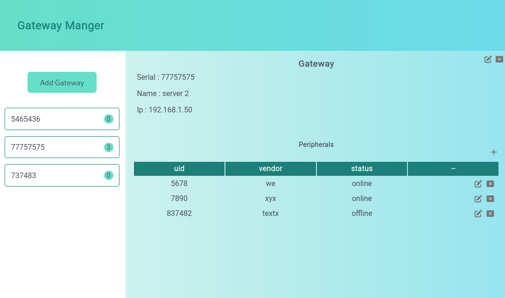

#### Gateway Management App

This is a REST service application designed to manage gateways - master devices that control multiple peripheral devices.
The application allows for storing information about gateways and their associated devices in a database.
The service offers various operations for managing gateways and devices, including validation of input data,
displaying gateway details, and adding/removing devices from a gateway.

#### Each gateway has:

- a unique serial number (string),
- human-readable name (string),
- IPv4 address (to be validated),
- multiple associated peripheral devices.

#### Each peripheral device has:

- a UID (number),
- vendor (string),
- date created,
- status - online/offline.

## Stack

- Frontend: React.js (typescript)
- Backend: NodeJS + Express + MongoDB REST API (typescript)

### installation guides

- 1- Clone this repo: `git@github.com:tawargy/m-gateways.git`
- 2- Move to the cloned directory: `cd m-gateways`
- 3- Run `docker compose up`
- 4- open http://localhost
